# CampusVision: Find your way

**Authors**

Mehdi

Vincent

Christopher

Danil

Daniel

Doménique

---

## Abstract

_Author: Danil_

We developed a neural network for object detection of points of interest on the KIT campus. Our model training is based on self-taken photos and a pre-trained YOLOv4-tiny network. Therefore, we manage to deploy the model on an _NVIDIA_ _Jetson Nano_. Starting with comprehensive data preparation, we finally show that our approach achieves a mean average precision of 89.33%, a frame rate of around 17 frames per second (FPS), and a model size lower than 24 megabytes.

For this project we worked with the following technology stack.

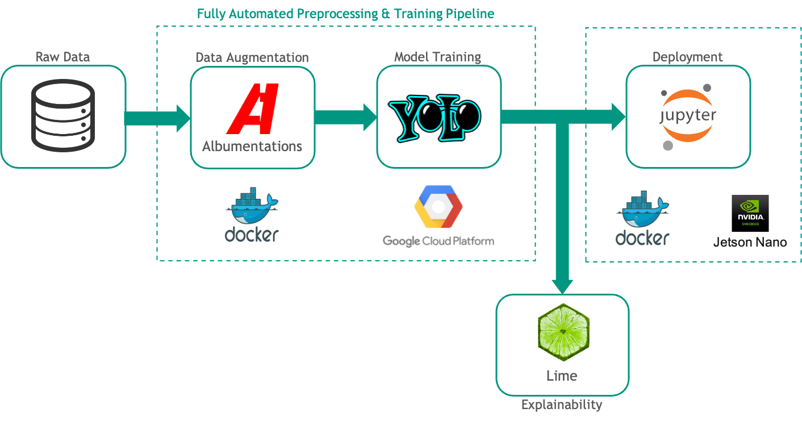

Technology Stack

# 1. Introduction

_Author: Danil_

## 1.1 Motivation

Following the strong performance of AlexNet in the ImageNet challenge in 2012, neural networks have outperformed traditional, feature-based approaches in most Computer Vision applications. In particular, in object detection, convolutional neural networks became the state-of-the-art approach.

Object detection is a problem consisting of both object classification and object localization. It already has numerous real-life applications ranging from autonomous driving, robotics, or medical imaging (e.g., [Vahab et al. 2019](https://www.irjet.net/archives/V6/i4/IRJET-V6I4920.pdf))[.](https://www.irjet.net/archives/V6/i4/IRJET-V6I4920.pdf)

Our challenge is about exploring a new use case involving new objects to be detected in real-time based on our own training data. Therefore we have limited training data availability. Further, given the deployment requirement on the _NVIDIA_ _Jetson Nano_, we are facing additional challenges. Namely that of limited computational power, limited memory, and deployment implementation. However, having a team of six AI-interested students, we enjoyed working under these restrictions.

## 1.2 Structure of this documentation

We start with a further exploration of the underlying business case having a look at both the ideation process and the market (Sec. 2). Further, we continue with the data gathering and preprocessing steps (Sec. 3). This is followed by an analysis of our model choice (Sec. 4), a deep dive into the training process (Sec. 5), and and evaluation of the performance of the chosen architectures (Sec. 6). Finally, we describe the operating principles of our deployment pipeline (Sec. 7), provide an outlook and conclude our results (Sec. 8).

# 2. Business Case

_Author: Danil_

## 2.1 Ideation

Before the first team discussion, we came up with more than 30 novel use cases for detection problems that can be solved with Computer Vision. We evaluated these ideas based on different criteria, such as importance, feasibility, and team fit. Having broken down the pool of ideas, we discussed the most suitable ideas and business cases - for example, a returnable bottle detection, a mask detection, and the point of interest detector in detail. Finally, the point of interest detector turned out to be the problem we consider the most promising.

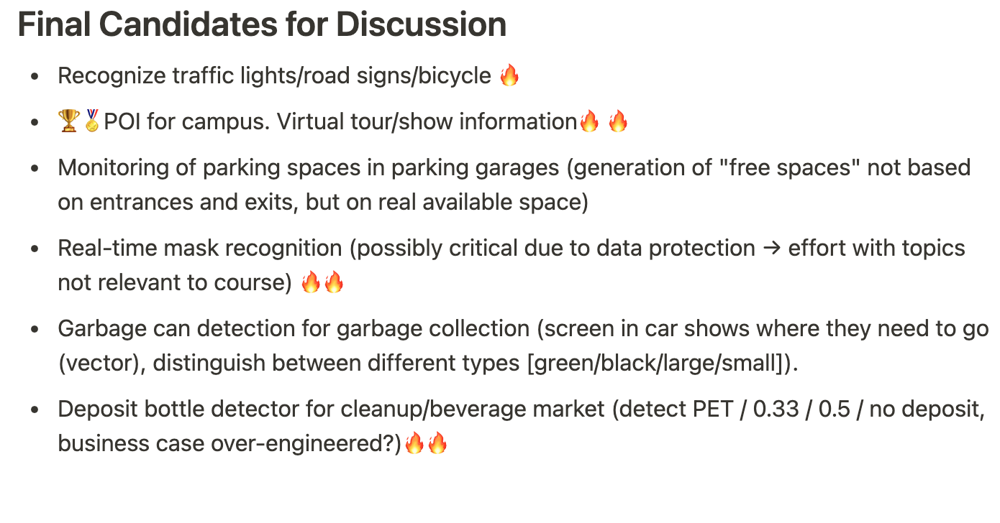

Ideas we considered in the final discussion

## 2.2 Problem definition

We made a few observations that highlight the current relevance of the problem. First, new students often have difficulty finding their way around campus. Since O-Phase was not in person, there were no campus tours. Second, our group members study for many years at KIT and do not know most of the statues on campus. Third, due to the COVID-19 pandemic, there are fewer tours in Karlsruhe and on the KIT campus for travelers and tourists.

We address issues these people might have, providing real-time detection of buildings on the KIT campus given video feed taken from a smartphone. Also, our solution should provide additional information about the detected buildings at market introduction.

## 2.3 Market insights

In order to confirm our initial hypotheses about the relevance of the topic and our user's needs, we decided to rely on insights from both market research and customer interviews. This enables us to get a better understanding of the problem-solution fit.

We acquired market research insights by first researching the top-level market which is related to detecting buildings and getting information about them: the mobile augmented reality market.

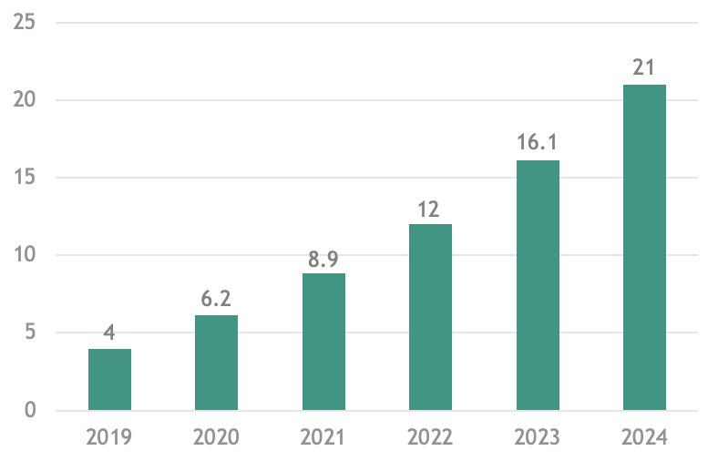

Augmented reality market (billion US$)

[Statista data](https://www.statista.com/statistics/282453/mobile-augmented-reality-market-size/%E2%80%8B) shows a promising market size of US$ 8.9 billion in 2021. Further, the market has a high growth projection. The compound annual growth rate between 2019 and 2024 is about 39%.

$$
\text{CAGR}_{2019-2024}=(\frac{21}4)^{0.2} -1 = 39.33\%
$$

[D'Arcy Coolican (2019)](https://a16z.com/2019/12/09/product-zeitgeist-fit/) emphasized the timing of startups and popularized the term product zeitgeist fit. The augmented reality market development indicates that our solution might be developed at the right time and has a good product-zeitgeis fit. This is confirmed by recent press coverage emerging about augmented reality (e.g., [Mundt 2020](https://www.industry-of-things.de/der-einstieg-in-ar-ist-jetzt-a-898014/)) and by AR and VR climbing the slope of enlightenment on the Gartner Hype Cycle ([Lassere 2020](https://blog.techviz.net/gartner-hype-cycle-virtual-reality-hype-or-hope)).

Knowing that analogies from the augmented reality market cannot be drawn directly to our use case, further target group interviews were conducted. Especially the following statements from our interview summarize some key insights. We contacted the KIT webmaster team, which is responsible for the management of the KIT navigator app, and are currently waiting for their response.


Feedback we received after showing our prototype

# 3. Preprocessing

## 3.1 Data acquisition

_Author: Mehdi_

The dataset used to feed the tiny-yolo-v4 model was created by the team members. Pictures of several buildings of the university campus at the KIT were taken using a 12MP wide-angle camera. The focus was a set of 14 specific buildings on the campus. These are summarized in the following table:

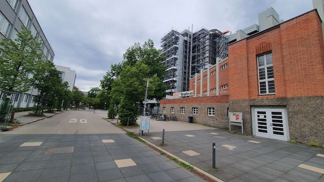

AKK

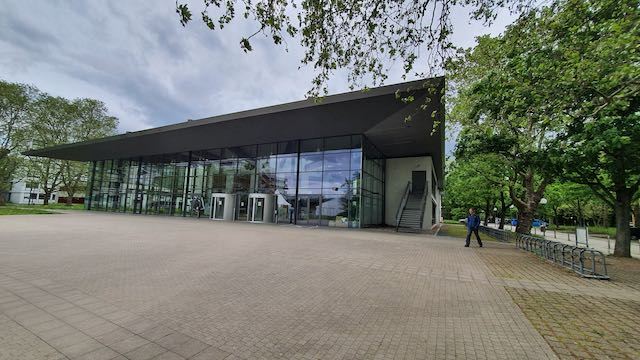

Audimax

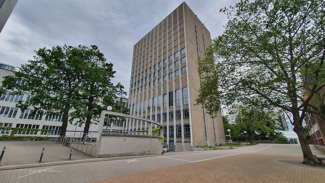

Alte Bibliothek

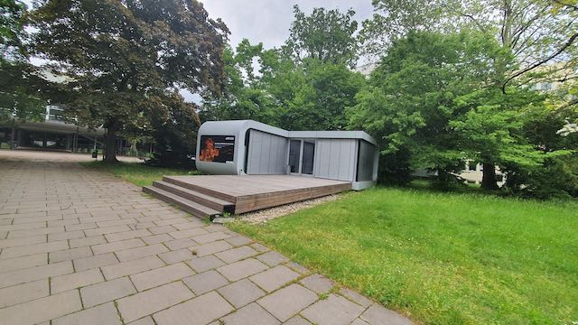

Gründerschmiede

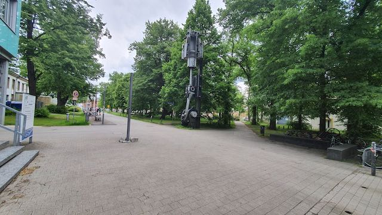

Kolben

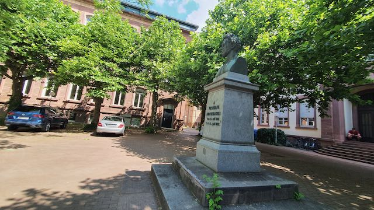

Denkmal, Ehrenhof

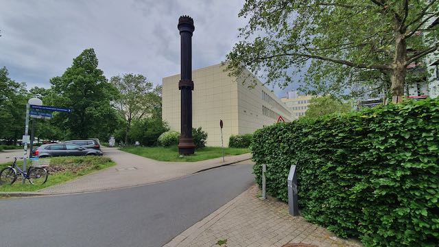

Haber Bosch Reaktor

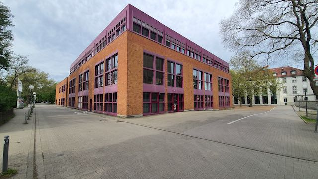

Mensa

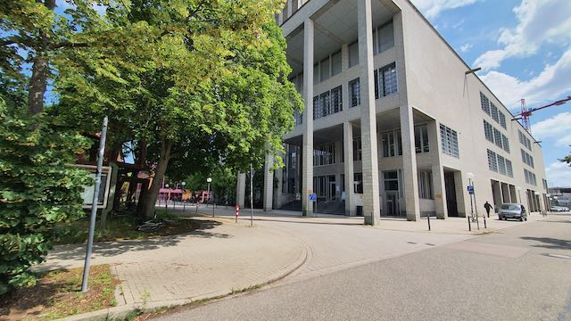

Neue Bibliothek

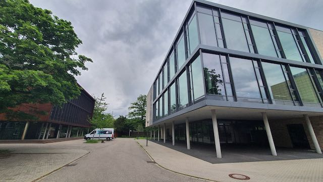

Lernzentrum

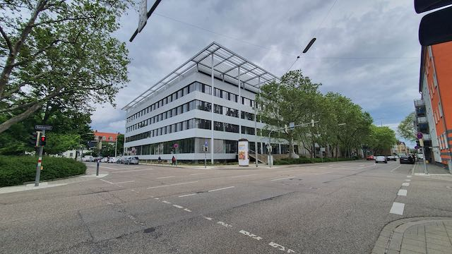

Mathebau

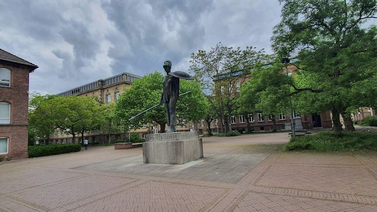

Soldat, Ehrenhof

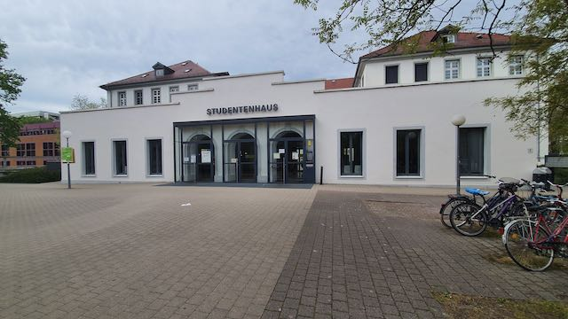

Studierendenwerk

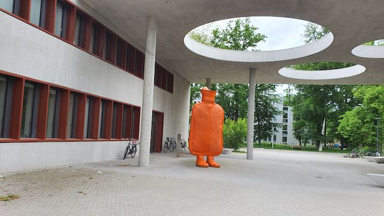

Wärmflasche

While capturing the buildings, many factors related to light, capture angles, and weather conditions were taken into consideration. In order to aim a rich variation of the dataset, the photos were taken at different times of the day with various light levels from different wide and close angles. For buildings with glass fronts, we mainly focused on capturing possible reflections such as the sun reflection or the reflection of other objects on the façade. In addition to images containing single objects, we considered picturing the buildings from specific angles to get multiple buildings on a single image as well.

### 3.1.1 Labeling

The next step after taking the building's images was to label the whole dataset. This was done manually with the help of the *[LabelImg](https://github.com/tzutalin/labelImg)* tool (see the following illustration).


_LabelImg_

In the labeling process, we first started by creating a .txt file containing all the labels (classes.txt) in order to have consistency. The *LabelImg* tool provides the possibility of directly saving the labels in an appropriate yolo format. Labeling the images with *LabelImg* bases on contouring the object/s to be detected on the image with bounding boxes, selecting the correspondent label/class, and saving the output in a .txt file in the yolo format. The resulting .txt file includes the following information in the following sequence: class index, normalized `[x_center, y_center, width, height]`.

### 3.1.2 Data Management & Execution Pipeline

To have a central saving of the data and to ensure collaborative teamwork, the labeled dataset (images + txt_label_files) was uploaded to the group's own *Google Drive* so that it is available for all team members. This way we ensured a parallel workflow on the different project parts: basically the preprocessing and several tries to optimize the built model. Later, we created a fully automated pipeline to guarantee an automated, easy, and standardized execution of the preprocessing, training, and testing workflow.

In the following, we will give a general overview of the pipeline with a focus on the preprocessing side. The pipeline is based on a list of functions that will be processed following the FIFO principle. Each pipeline function accepts a data frame (see below) as input and outputs a (modified) data frame, which will then be the input of the next function.

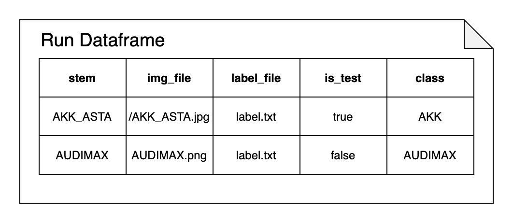

Example of the data frame passed between the pipeline functions

In the first step of our preprocessing pipeline, all images will be read from the input folder in a data frame following the sequence of the class names. To avoid inconsistency while reading images, a type-conversion will be previously executed to provide a standard JPG format as input. Afterward, the dataset images get resized by the call of the resize images function. In this function, we iterate over the image data frame and resize all the input images to a resolution of 800x800 pixels given as a setting in the configuration file. As a result, we ensure a standard images resolution on which we can proceed with our further crops and augmentations. After resizing the input images, the dataset is split into a training and test set by default. The test set includes 20% of the totality of the images (the train/test split can be altered in the code). The test images will be only used for the model validation. These won't undergo any further augmentations or changes except the resizing to our final image size of 416x416 pixels. The training dataset, however, which contains 80% of the initial images will be enriched. This occurs mainly through enlarging the set with augmented data. More about the augmentation function will be related in the subchapter augmentation.

In order to have statistical security about the model training results, our pipeline should also be able to conduct a cross-validation. Therefore, we additionally implemented a k-fold split option. By choosing the desired number of folds, the resized dataset will be shuffled and split into the k-folds. For each of the k-folds, one subsample is used for testing. The remaining k−1 folds are used for training. This results in k different train/test combinations. For each of the combinations, a new folder is created, containing the data frame with the information about the train and test images. Then each of the k folders containing their respective data frame will be processed by the pipeline separately, resulting in k sets of augmented images. The augmented images will be stored in the respective folder. Also the `darknet.data`file is created for each folder respectively containing information about the images used for training and testing as well as the class names. The `darknet.data` file is also created for the default train/test split mentioned above. In the final step of the preprocessing-run-loop, we create the `yolo.cfg` configuration file. This file contains mainly the set-up training parameters, e.g. the desired maximum batches per class or the color channels.

The following figure illustrates the structure of the preprocessing pipeline.

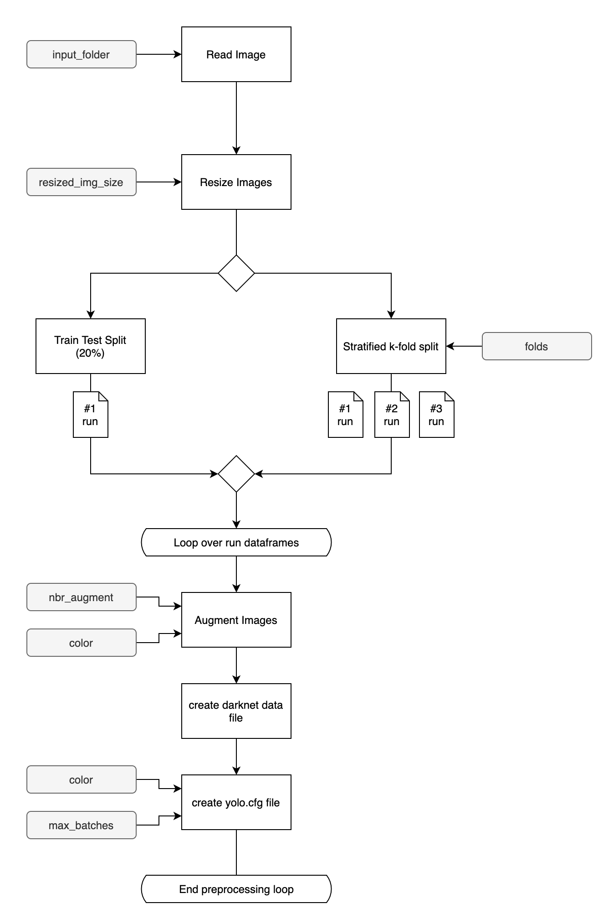

Preprocessing Pipeline

## 3.2 Augmentation

_Author: Vincent_

**Augmentations in the pipeline**

As we were not able to take and label thousands of images for each class for the object detection and we wanted to increase robustness and prevent overfitting ([Shorten und Khoshgoftaar 2019](https://journalofbigdata.springeropen.com/articles/10.1186/s40537-019-0197-0)), we decided to generate multiple augmentations (can be set as an attribute for the pipeline) for every training image. If "no label images" are used in the run, the augmentation pipeline for those was adapted. It is a reduced and simplified version of the original pipeline just applying the image transformation and ignoring all specifics regarding bounding box augmentation.

The general notion we followed there was not to go to the extreme but still capture different distortions in our training data that could realistically occur during application. Capturing plenty of different distortions is crucial for the success of augmentation as previously unseen characteristics of distortions have proven to detrimentally decrease the overall detection of an instance in some cases ([Michaelis et al. 2019](http://arxiv.org/pdf/1907.07484v2)). We chose *[Albumentations](https://albumentations.ai/docs/)* for augmentation. It provides a transformation of the bounding box when geometric transformations are applied. Moreover, *Albumentations* provides a good variety of possible distortions to work with, is relatively fast, and integrates well into our preprocessing pipeline.

For comparability between our training runs it has to be said, that all probabilistic/random elements in the augmentation process were set with a defined seed / random state so the same augmentations are applied in different runs to keep results comparable.

We envision using three configurations for models which could be changed by fetching the calendar date and sunrise and sunset times from an API. One particular trained for winter, early spring, and late autumn months with a tendency for bad weather (rain and snow) and darker light conditions (configuration 1) and one which is run during summer months (configuration 2), we built two possible functions with compositions in *Albumentations*. The third configuration is trained on nighttime image data and should run on configuration 2's augmentation composition. We focused on configuration 2 in our training runs as it resembles the primary use-case of the system and we had sufficient data to train and validate our models with.

For configuration 2 we built a relatively simple composition that works for both color and greyscale images.

For configuration 1 we at first built 2 separate augmentation compositions with *Albumentations* for color or grayscale images. As we found out with our training runs with configuration 2 color significantly outperformed grayscale which is why we dropped the greyscale composition for configuration 1, which now supports only RGB-input images for augmentation.

In *Albumentations* transformations for augmentation are applied in a probabilistic fashion. Hence the probability of applying each transformation is an essential parameter for generating useful augmentations which do not sacrifice accuracy because everything is just completely mashed together. Moreover, *Albumentations* allows for XOR logic when applying transformations.


Table of Augmentations chosen

Basic image parameter variations/filters like contrast, brightness, saturation, color values, and distribution curves (ColorJitter, RandomBrightnessContrast, RandomGamma) aim at increasing diversity based on our data collection. In a way, this simulates different camera sensors which could be present in the application. Hence these transformations are applied with high probabilities.

Sharpen, MotionBlur and Blur can be seen as parameters that in real-life are mainly dependent on how fast a camera focuses properly. As modern cameras barely have issues with that, particularly in good lighting conditions, the probabilities are set relatively low in configuration 2 particularly.

Other augmentations like GaussNoise ([Rath 2020](https://debuggercafe.com/adding-noise-to-image-data-for-deep-learning-data-augmentation/)), FancyPCA ([Krizhevsky et al.](https://proceedings.neurips.cc/paper/2012/file/c399862d3b9d6b76c8436e924a68c45b-Paper.pdf)), CLAHE, and Equalize have been shown to improve model robustness or tent to improve the learnability of features which is why they are all applied with moderate probabilities.

.png>)

Original

-2.png>)

Non-geometric transformations applied

In configuration 2 RandomRain, RandomSnow and RandomFog offer augmentations to simulate significantly different weather conditions to those when the images were taken to increase the robustness of the model to scenarios that are more likely in the colder season. As a combination of these filters goes too extreme we prevented it from occurring with the already mentioned XOR-logic that *Albumentations* offers. RandomFog could also be seen as an effect that simulates a dirty lens of the phone which may not be specific to the colder season.

.png>)

Original

.png>)

Example for RandomRain

Augmentations like RandomCrop and ShiftScaleRotate are geometric transformations that are essential for improving our model as it is unlikely that the application will be used only from the same perspectives we shot our training data and the camera might be tilted at an angle. Cropping also helps our model to learn different parts of an object. Particularly when cropping the image it can happen that the labeled object may not be sufficiently visible anymore. In the case that less than 20% of the label is still visible, the augmentation is considered not to be of any use anymore and a new augmentation is generated instead which is also checked for this threshold.

.png>)

Original

.png>)

Geometric transformations applied

To get a more reliable and robust model we took inspiration from the Cutout method ([DeVries und Taylor 2017](http://arxiv.org/pdf/1708.04552v2)) and covered multiple randomly generated regions (random size in a specified range and random positioning in the image) of the image with black pixels. This transformation of our image data is applied with a probability of 50% ([DeVries and Taylor 2017](http://arxiv.org/pdf/1708.04552v2)). If applied, it hides part of the labeled objects and forces the algorithm to learn different features of it and hence becomes more robust. This relates to the real-world scenario that a construction site for instance might cover part of the object to detect in application practice.

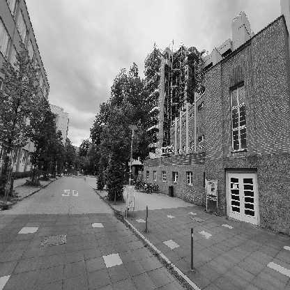

Original

.png>)

Partly occluded

Preprocessing of the datastream from the _Jetson_ itself is kept minimalistic with only scaling being applied to avoid performance losses and keep up the framerate.

# 4. Model

_Author: Daniel_

## 4.1 First thoughts

As we thought about which model to choose for our object detector, we first discussed, what requirements our case places on the model. We agreed that to get a good user experience, we want the model to perform in real-time at around 24 frames per second. Furthermore, in order to get a good performance, we want the model to run at a resolution of at least 416x416 px. Another aspect that we had to keep in mind when choosing an object is the limited processing power of the _NVIDIA_ _Jetson Nano_ and our own resources. So we needed a model that required little processing power during training and had a high frame rate and mAP during inference.

## 4.2 Technical aspects

The most common types of CNN architectures for object detection are one-stage and two-stage detectors. The main difference between them lays in the separation of localization and classification:

Two-stage detectors propose regions-of-interest (ROI) for potential object locations using methods like selective search in a first step. In a second step, they scale these regional proposals to the size required by the CNN architecture and perform classification with those regions.

One-stage detectors unify the regional proposal and classification in a single step. They look at the whole image at test time so its predictions are informed by the global context in the image. In YOLO, the most popular one-stage detector, the input images get split up into grid cells after it has been resized to the required size. Afterward, B bounding boxes are predicted by the model. Each box gets a confidence score, the probability that a box contains an object. Also, one object is detected in each box after calculating conditional probabilities for each class. In the last step, the conditional class probability is combined with the confidence score to get the class confidence score (ccs). This ccs is then used for creating the final predictions.

YOLOv2, v3, and v4 have implemented various improvements like anchor boxes, multi-label classification, mosaic data augmentations, and DropBlock to increase the accuracy while keeping a fast inference time.

Though two-stage detectors are more accurate in general, one-stage detectors tend to be faster in training and inference due to the unification of region proposals and detection into one step, which makes them a perfect fit for our use case of real-time object detection.

## 4.3 Model Choice

Because of the facts mentioned above, we kept a focus on one-stage detectors when choosing a model as they promise a faster inference. We noticed that the YOLOv4 model best suits our needs, as it shows the best results at a high FPS rate when tested on the MS COCO dataset when compared to other object detectors. In the comparison below, it constantly lays on the Pareto optimal curve. In the MS COCO Dataset, the detectors are tested with around 20,000 images containing 80 different types of objects. ([Alexey et al. 2020](https://arxiv.org/pdf/2004.10934.pdf))

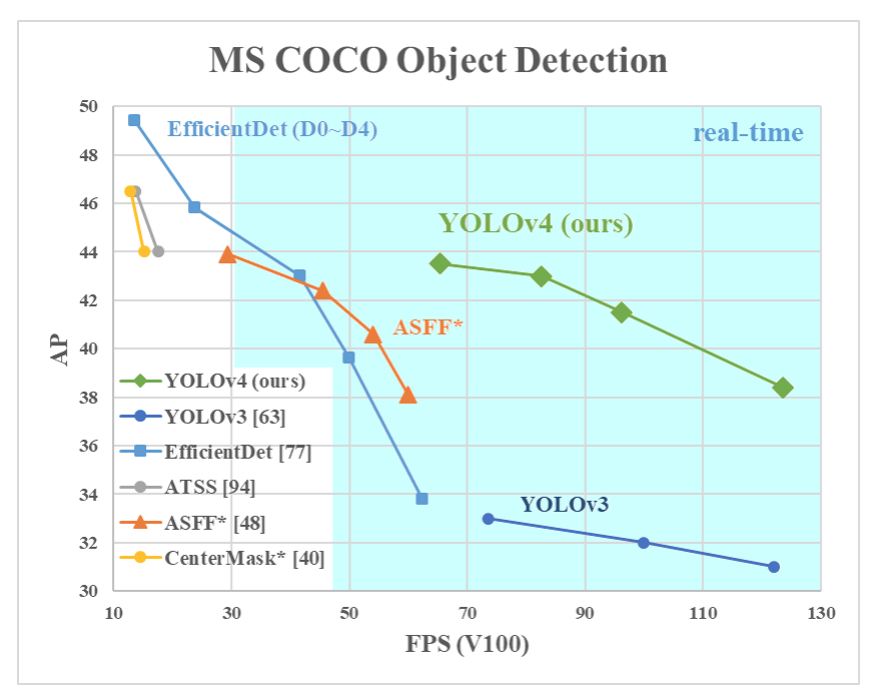

Comparison of different object detectors concerning frames per second and mean average precision. Source: [Alexey et al. 2020](https://arxiv.org/pdf/2004.10934.pdf)

For our business case, YOLOv4-tiny, the compressed version of YOLOv4, is the better option as a higher FPS is more important than precision or accuracy in a real-time object detection environment. With YOLOv4-tiny, we can achieve much faster training and much faster detection as it has 29 pre-trained convolutional layers while YOLOv4 has 137. The FPS in YOLOv4-tiny is approximately eight times that of YOLOv4. However, the accuracy for YOLOv4-tiny is 2/3rds that of YOLOv4 when tested on the MS COCO dataset.

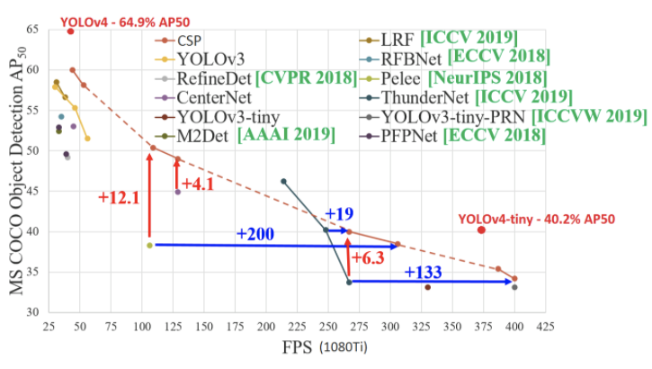

Comparison of different object detectors concerning frames per second and mean average precision with quantitative differences. Source: [Medium](https://miro.medium.com/max/1400/1*h3TR3znA4zQST8wOy1PFEw.png) (accessed: 09.07.2021)

Another point in favor of the YOLOv4-tiny model is the low difficulty of training the model to detect its own objects. While most models need to be trained with multiple GPUs in order to get the stated AP, YOLO can be trained on a single GPU while still getting a good inference performance in a reasonable training time. The implementation of YOLOv4-tiny by [AlexeyAB](https://github.com/AlexeyAB/darknet) allows us to train the CNN on our own custom classes based on pre-trained weights that are trained on the MS-COCO dataset. Since our task is exactly to detect custom objects, i.e., points of interest on the campus, we decided to use this repository as the foundation of our model.

# 5. Training Process

_Author: Christopher_

## 5.1 Initial Approach

With our labeled and preprocessed images stored in our *Google Drive*, we started training our first `YOLOv4` greyscale model on one of our own laptops. As all of our group members didn't have a computer with a GPU, we had to build *Darknet* for CPU usage. The first training took a whole night, but the effort was worth it. The results were acceptable:

-   **Recall**: 0.58
-   **mAP@0.50**: 59.26%

We were quite happy that it worked on the first run. But there was still a lot of room for improvement.

After our first run, we focused on getting access to a GPU environment. After several considerations, we agreed on using *Google Colab*'s GPU environment, as it gave us the flexibility to try things out in the early stages of model training and tuning. By using *Colab* we could improve our training time from one night to under 1.5 hours, allowing us to try out different preprocessing and augmentation options.

## 5.2 Automated Training Pipeline & Environment

Using *Google Colab* as our training platform still required many repetitive manual steps:

1. loading the dataset from *Google Drive,*
2. apply the preprocessing pipeline,
3. invoke the *Darknet* training command with the right `tiny-yolo.cfg`, `darknet.data` and pre-trained weights,
4. calculate the statistics after the run and
5. finally copying the weights and results to our *Google Drive.*

In addition to that, we wanted to cross-validate the different trained models to have a more accurate estimate of the model's prediction performance. We wanted to use 5-fold cross-validation to compare the performance of different parameter configurations on a profound basis. Doing cross-validation with multiple parameter configurations in *Google Colab* was nearly impossible as notebook instances would be removed after some time of inactivity, meaning we had to check every ten minutes if the training did complete, or our GPU contingent was exhausted. Also, 5-fold cross-validation would increase the repetitive manual steps by the factor of five.

This meant that we had two problems to solve:

1. Reduce manual repetitive steps
2. Find a suitable test environment with unlimited GPU runtime

### 5.2.1 Training Pipeline

The solution to our first problem was to extend our preprocessing pipeline into a holistic training pipeline. It already contained all the information necessary to run the training command and calculate the statistics afterward for all the different folds.

The problem however was to get that information, as the path to the `darknet.data` file or the adapted `tiny-yolo.cfg`, out of the `Pipeline` class (Python) into the *Darknet* command which is invoked through the command line:

```bash
./darknet detector train **darknet.data** **tiny-yolo.cfg** **pretrained-weights**
```

The solution to this problem was the `subprocess` library. This library can invoke command line commands from within a Python script. After some tinkering, we finally managed to run the *Darknet* training command from within Python. Now with a single command, the preprocessing of the images will be triggered and after all preprocessing steps are completed the training is automatically invoked for the preprocessed dataset. This also works for multiple folds. The transition to our fully automated pre-processing and training pipeline adds the following steps to our preprocessing pipeline:

First, all preprocessing steps for each fold (run) are completed. Then with all the different pieces of information about all the folds, the training is invoked for each of the folds with the respective `darknet.data` (contains test and train sets for the specific fold) as well as the `tiny-yolo.cfg` and the pre-trained weights which are both the same for all runs. After each run is completed, the statistics are calculated automatically and saved in the results.txt file. After all, runs are processed the respective results and weights are copied to a location of choice. The process is visualized below.


Fully Automated Preprocessing & Training Pipeline

### 5.2.2 Cloud Training Environment

Regarding our second problem, we agreed that we needed a cloud environment with unlimited access to GPU runtime as our laptops and *Google Colab* were of no choice. After a little research, we found two promising solutions: *Amazon Web Services (AWS) Sagemaker* and *Google Cloud AI Platform (GCAIP)*. As we already had a good experience with Google Drive and Colab and *Google Cloud* offers 250$ credit to newly registered members, we agreed on using *GCAIP*as our training environment.

*GCAIP* builds on the concept of dockerized training. You can submit a CUDA-enabled Docker container with your training code to a job list and *GCAIP* will process jobs in the list according to the FIFO principle. The results can then be saved in a storage bucket.


Google Cloud AI Platform (_GCAIP_)

### 5.2.3 Dockerized Training

Based on *Google's* Documentation of the *AI Platform* we used the following image from *NVIDIA* as our basis to build on: `docker.io/nvidia/cuda:10.1-cudnn7-devel-ubuntu18.04`. For running our pipeline we needed to install Python 3.8 as well as *Darknet* with GPU support from the [AlexeyAB repo](https://github.com/artynet/darknet-alexeyAB). Afterward, we needed to install the *Google CloudSDK* (command-line tools) in order to save our results at the end of each job run in the storage bucket. The last two steps are cloning our Github repository containing the pipeline code as well as executing the pipeline with a certain parameter configuration. In order to accomplish the last two steps we saw two options:

1. Add the pipeline code into the Docker-Image and then have our pipeline command as the image's entry-point
2. Write an entry-point shell script that downloads the latest code from Github at runtime and execute the pipeline command

We eventually argued for option 2 as it gave us flexibility by allowing us to change the codebase without rebuilding the Docker-Image each time we changed our pipeline code and thus saving us valuable time. Also, we included our labeled images in our Github repository allowing us to download the pipeline code as well as the dataset in one go. Apart from downloading the latest release of our pipeline, the shell script accepts the parameters that can be used to alter the behavior of the preprocessing and the training (see table at the bottom) and initialized the pipeline with the parameters specified. The parameters can be conveniently defined during the creation of a job on the *GCAIP* website:


Parameter Definition in *GCAIP*

The approach of dockerized training in addition to the flexibility of automatically having the latest code version in the docker image, allowed us to efficiently conduct our training, alter our pipeline in case of errors with heavily reduced Docker-Image rebuilds. Furthermore, the ability to queue jobs enabled us to perform jobs overnight. Especially this wouldn't have been possible with *Google Colab*. Also in contrast to *Google Colab,* we practically had unlimited GPU runtime within our 250$ credit range, allowing us the verify our final image with 10-fold cross-validation that roughly took 12 hours.

[Pipeline Parameters](https://www.notion.so/11195866e87b4701817753342e91b6e3)

## 5.3 Docker File & Shell Script

Below you can find our Docker file among the shell script that executes the pipeline.

```docker
FROM docker.io/nvidia/cuda:10.1-cudnn7-devel-ubuntu18.04
LABEL maintainer "Christopher Woelfle"

RUN echo 'debconf debconf/frontend select Noninteractive' | debconf-set-selections

ARG GPU=1
ARG CUDNN=1
ARG CUDNN_HALF=0
ARG OPENCV=1

# Set environment variables
ENV LC_ALL=C.UTF-8
ENV LANG=C.UTF-8
ENV LIBRARY_PATH /usr/local/cuda/lib64/stubs

# Install needed libraries
RUN apt-get update && \
    apt-get upgrade -y && \
    apt-get install -y clang-format wget apt-utils build-essential\
    checkinstall cmake pkg-config yasm git vim curl\
    autoconf automake libtool libopencv-dev build-essential

# Install python-dev
RUN apt-get update && apt-get install -y python3.8-dev python3-pip
# Install all needed python librarires
RUN python3.8 -m pip install --upgrade pip
RUN python3.8 -m pip install albumentations==1.0.0 matplotlib==3.4.2 numpy==1.21.0 opencv-python==4.5.2.54 pandas==1.2.5 rich==10.4.0 scikit-learn==0.24.2

# Create working directory
WORKDIR /

# Fetch Darknet
RUN git clone https://github.com/AlexeyAB/darknet.git
WORKDIR /darknet
RUN export PATH=/usr/local/cuda/bin${PATH:+:${PATH}}
# Modify Makefile according to needed env variables
RUN \
    sed -i "s/GPU=.*/GPU=${GPU}/" Makefile && \
    sed -i "s/CUDNN=0/CUDNN=${CUDNN}/" Makefile && \
    sed -i "s/CUDNN_HALF=0/CUDNN_HALF=${CUDNN_HALF}/" Makefile && \
    sed -i "s/OPENCV=0/OPENCV=${OPENCV}/" Makefile && \
    make
RUN wget https://github.com/AlexeyAB/darknet/releases/download/darknet_yolo_v4_pre/yolov4-tiny.conv.29

# Installs google cloud sdk, this is mostly for using gsutil to export model.
RUN wget -nv \
    https://dl.google.com/dl/cloudsdk/release/google-cloud-sdk.tar.gz && \
    mkdir /root/tools && \
    tar xvzf google-cloud-sdk.tar.gz -C /root/tools && \
    rm google-cloud-sdk.tar.gz && \
    /root/tools/google-cloud-sdk/install.sh --usage-reporting=false \
    --path-update=false --bash-completion=false \
    --disable-installation-options && \
    rm -rf /root/.config/* && \
    ln -s /root/.config /config && \
    # Remove the backup directory that gcloud creates
    rm -rf /root/tools/google-cloud-sdk/.install/.backup

# Path configuration
ENV PATH $PATH:/root/tools/google-cloud-sdk/bin
# Make sure gsutil will use the default service account
RUN echo '[GoogleCompute]\nservice_account = default' > /etc/boto.cfg

# Copies the trainer code
WORKDIR /
COPY start.sh /scripts/start.sh
RUN ["chmod", "+x", "/scripts/start.sh"]
# Sets up the entry point to invoke the trainer.
ENTRYPOINT ["sh","/scripts/start.sh", "-darknet=/darknet", "-path=/"]
```

```bash
#!/bin/bash
CURRENT_PATH="/"
COLOR=false
OCCLUDE=false
MAX_BATCHES=3000
FOLDS=1
NAME=$(date +%Y%m%d_%H%M%S)
NBR_AUGMENTATIONS=10
DARKNET="/darknet"
TRANSFORM=1
INCL_NO_LABEL=false
IS_FINAL=false

for arg in "$@"
do
    case $arg in
        -path=*|--path=*)
        CURRENT_PATH="${arg#*=}"
        shift # Remove argument from processing
        ;;
        -darknet=*|--darknet_path=*)
        DARKNET="${arg#*=}"
        shift # Remove argument from processing
        ;;
        -c|--color)
        COLOR=true
        shift # Remove argument from processing
        ;;
        -occl|--occlude)
        OCCLUDE=true
        shift # Remove argument from processing
        ;;
        -no_label|--incl_no_label)
        INCL_NO_LABEL=true
        shift # Remove argument from processing
        ;;
        -final|--is_final)
        IS_FINAL=true
        shift # Remove argument from processing
        ;;
        -b=*|--max_batches=*)
        MAX_BATCHES="${arg#*=}"
        shift # Remove argument from processing
        ;;
        -f=*|--folds=*)
        FOLDS="${arg#*=}"
        shift # Remove argument from processing
        ;;
        -t=*|--transform=*)
        TRANSFORM="${arg#*=}"
        shift # Remove argument from processing
        ;;
        -n=*|--name=*)
        NAME="${arg#*=}"
        shift # Remove argument from processing
        ;;
        -a=*|--augmentations=*)
        NBR_AUGMENTATIONS="${arg#*=}"
        shift # Remove argument from processing
        ;;
    esac
done
COMMANDS="-n=$NAME -o /aisscv/model -f=$FOLDS -max_batches=$MAX_BATCHES -nbr_augment=$NBR_AUGMENTATIONS -darknet=$DARKNET -t=$TRANSFORM"

(cd "$CURRENT_PATH" && git clone https://github.com/mbc95/AISS_CV.git aisscv)

if $COLOR
then
  COMMANDS="$COMMANDS -c"
fi

if $OCCLUDE
then
  COMMANDS="$COMMANDS -occl"
fi

if $INCL_NO_LABEL
then
  COMMANDS="$COMMANDS -incl_no_label"
fi

if $IS_FINAL
then
  COMMANDS="$COMMANDS -is_final"
fi

echo "Running script with: $COMMANDS"
(cd "$CURRENT_PATH"aisscv/preprocessing/ && python3.8 run_train.py $COMMANDS)
```

# 6. Results & Evaluation

_Author: Christopher, Domenique_

With our automated training pipeline at hand, we were able to conduct multiple experiments in which we varied various parameters. The different random generators used in the pipeline, for example for the augmentation or the k-fold split were seeded to ensure that differences in the performance metrics of the different runs originate from the parameter variation and not from a difference in the training data. With the seeds in place, running the pipeline multiple times independently with the same parameters results in the same output regarding the augmentations applied to the images as well as in the same folds.

**For each experiment a 5-fold cross-validation with a threshold of 0.25 was applied. The results of the five runs are aggregated by using the mean value.**

## 6.1 Experiments

As stated, we used 5-fold cross-validation to assess the performance for different parameter settings and compare them. We selected different parameters that we wanted to examine and tested them against our base model, which was trained on colored images, included 10 augmentations per image, and with the recommended maximum batches of 3000 (duration of the training process) per class. It should be mentioned that we kept the assessment to the bare minimum and the results should be treated with care - especially the estimation of the standard deviation - as we only applied one five-fold cross-validation per parameter configuration. For a more sophisticated assessment and with the necessary computational power at hand, one should e.g., do multiple k-folds cross-validation and then use hypothesis testing to assess whether the differences in performance are statistically significant [(Jiawei Ha, Micheline Kamer, Jian Pei, 2020](http://myweb.sabanciuniv.edu/rdehkharghani/files/2016/02/The-Morgan-Kaufmann-Series-in-Data-Management-Systems-Jiawei-Han-Micheline-Kamber-Jian-Pei-Data-Mining.-Concepts-and-Techniques-3rd-Edition-Morgan-Kaufmann-2011.pdf), p. 372 ff.).

### 6.1.1 **Greyscale vs. Color**

In our first experiment, we compared the performance of a model trained on greyscale images vs. a model trained on colored images (RGB). For each image, ten augmentations were generated. The augmentations applied were the same for greyscale and colored images.


Comparing the aggregated results of each 5-fold cross-validation, we can see an average recall improvement of around 92% when training on colored images. Also, the mAP increases by around 46%. Furthermore, the standard deviation across the five runs for each cross-validation is much smaller with colored images, which might be an indicator that training on colored images will lead to a more robust model.

**Using colored images for training results in a huge performance boost. For further experiments, only colored images are used**

### 6.1.2 Variation of the number of augmentations (#5, #10, #15)

In our second experiment, we varied the number of augmentations per image. We started with five augmentations, then increased the number to ten and later to fifteen. The experiment was conducted with colored images.


Current literature states that “augmented data will represent a more comprehensive set of possible data points, thus minimizing the distance between the training and validation set, as well as any future testing sets”, thus minimizing overfitting ([Connor Shorten, Taghi Khoshgoftaar](https://www.researchgate.net/publication/334279066_A_survey_on_Image_Data_Augmentation_for_Deep_Learning) 2019) . In our experiment, the decrease in standard deviation between the cross-validation on five (0,87% points) and ten (0.47% points) aligns with the literature that more augmentation leads to a more robust model. Oddly enough, we experience a strong increase in standard deviation for 15 augmentations per image while performance was slightly decreased. Taking current literature as well as our own findings under consideration, we selected ten augmentations for further experiments, since it seems to be the most robust setting at the time.

### 6.1.3 Occlusion (Cutout)

We also wanted to assess the effect of occlusion on the robustness of the trained models. For this, we chose two different values for the probability $p$ and maximum size of the occluded areas. So an image is selected with a probability of $p$ for occlusion processing ([Terrance DeVries, Graham W. Taylor 2017](https://arxiv.org/abs/1708.04552)).


The decrease of 1% point in mAP, while increasing the standard deviation by 57% between the two runs for different occlusion settings indicates that there needs to be a balance between the number of images used of occlusion as well as the size of the occluded areas. This also aligns with current literature. Oddly enough and against our expectations the base model yielded the best performance while also yielding the smallest standard deviation.

### 6.1.4 Unlabeled Images

Alexey states, that adding unlabeled images of objects which we do not wish to detect might improve model performance. In order to assess this for our model, we follow that recommendation and added pictures with “empty” labels into the training set.


Against our expectations, the model trained on data with unlabeled images increased neither performance nor robustness, since the values for IoU and mAP are lower while the standard deviation across the runs is higher by 28%.

### 6.1.5 Training Duration (Max. Batches)

Alexey recommends a maximum of 3000 batches per class for training. In our evaluation phase, we also tried out `max_batches` of 3500 and 4000 per class and compared those to the recommended value.


### 6.1.6 Occlusion (Cutout) and Un-Labeled Images

As the last test, we combined Cutout during augmentation with the use of unlabeled images during training.


Against our expectations and what the literature says, the base model yielded a slightly higher performance, while the standard deviations across the folds is only half of the standard deviation when using unlabeled images and occlusion.

### 6.1.7 Final Conclusion

After the assessment of different parameter settings was finished, we experienced it as challenging to decide which setting to choose for our final model training. The challenge rose especially since some findings contrasted with current literature but also the acquired sample sizes made it hard to find statistically significant differences. To get a deeper insight into the model performance we decided to run 10-fold cross-validation for the base model and our favorite parameter setting which was derived from current literature as well as our findings as followed. We used color for all further parameter settings due to the strong increase in performance. We chose 3500 as our `max_batches` size per class due to the higher mAP. Furthermore, we chose to occlude parts of an image with a probability of 0.5 and a max size of 0.035, while using unlabeled images.

## 6.2 Conducting a 10-Fold Cross-Validation

Finally, we applied 10-fold cross-validation to the basis model (denoted as M1) and "our" model which was trained with occluded and unlabeled images (denoted as M2). For further assessment, we treated the mAP values for each model as an independent sample from a probability distribution, which allows us to apply a t-student test with pairwise comparison/dependent samples since each run for model 1 and model 2 used the same test set. We used the `scipy.stats` `ttest_rel` implementation so calculate the t-test on TWO RELATED samples of scores. The results of the test are a test-statistic of - 0.0226 and a p-value of 0.83 which is not sufficient to reject the null hypothesis that the two samples are of the same distribution against any reasonable significance level. Therefore, the difference in the performance of those two models is probably due to chance. We chose M2 as our final model and used the respective parameters for the training on the entire data set since it is more in alignment with current best-practice. The loss function of the training of M2 can be seen below.


Results M1 (basis model)


Results M2


Loss function during training of M2

## 6.3 Explainability

### 6.3.1 Approach using LIME ([Marco Tulio Ribeiro, Sameer Singh, Carlos Guestrin](https://arxiv.org/abs/1602.04938) 2016)

We also wanted to get a rough understanding of how our model makes decisions and applied the LIME framework ([Marco Tulio Ribeiro, Sameer Singh, Carlos Guestrin](https://arxiv.org/abs/1602.04938) 2016). LIME (Local Interpretable Model-agnostic Explanations) was presented in 2016 as a "technique that explains prediction of any classifier in an interpretable and faithful manner, by learning an interpretable model locally around the predictions". In essence, it tries to explain which features led to the given prediction and if a certain feature value made the predicted class more or less probable. For an application in computer vision, each pixel represents a feature and therefore LIME will try to assess which pixels led to the classification of an image. Representing each pixel leads to explosive growth in the number of features e.g., an RGB image of size 416x416 denotes to almost 520.000 features, making computation infeasible. To decrease the number of features, pixels are aggregated to the so-called superpixel reducing the number of features drastically. In essence, LIME takes the original images and segments them into superpixels. Then the segmented image is taken and a fraction of superpixels are "turned off" and fed through the classifier. The Classifier returns an array with probabilities for each class. This process is repeated while randomly turning some superpixels off. Superpixels that have a higher effect on the probability of the class we are trying to explain are deemed to be more important for the classification of the model.

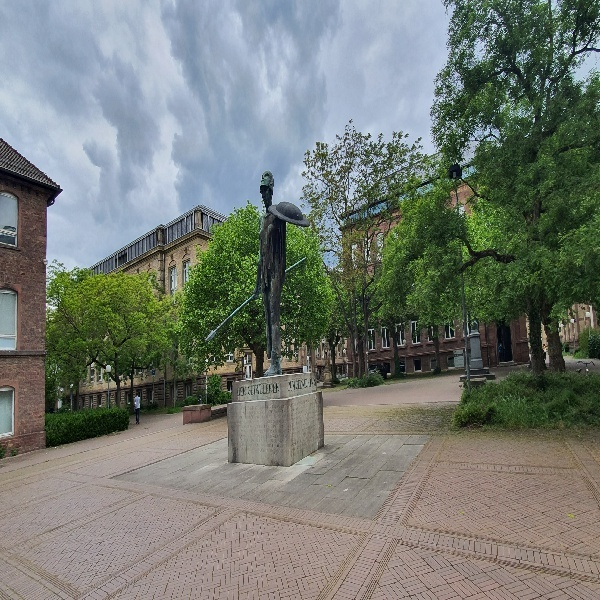

Original Image

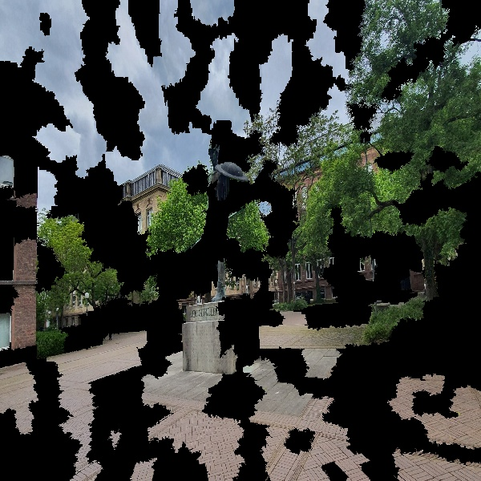

Original image segmented and with superpixels turned off

Since LIME was rather developed for classification than for object detection, we had to adjust the typical workflow. First of all, the LIME explainer requires an array of class probabilities whereas YOLO’s output contains bounding boxes and the confidence score for the detected class. To get an output processable by LIME we extract all detections of YOLO. The output contains an array for each detection with the coordinates of the bounding boxes, the confidence, and scores for all classes. The written function only returns the scores of the array containing the highest score for a class and treats it as the different class probabilities of the image. We treat the class with the most confidence as the label of the image, and we let LIME explain this classification. So basically, we explain the detection with the highest confidence and examine if only superpixels that belong to the object and lie within the bounding box affect the "detection". To get a better understanding of the classification part, we cropped the bounding box and let LIME explain this classification. Furthermore, we also wanted to try to explain multiple detections in one image. To achieve this, we let LIME again explain the object class that the model is most confident in and see where the features lie that decrease this confidence. The general idea behind this is the following: We want to use the explanation of the entire image to see whether the important features lie within the bounding box. This might give us some insight into the localization and classification. To obtain a deeper insight into only the classification part, we use the explanation on the cropped image. To see whether the model learned to distinguish between objects, we wanted to extract the features decreasing the confidence. If those belong to the other object in the image and lie within the respective bounding box, it might be an indication that the model reasons over the correct features and uses reasonable features to distinguish between different objects.

### 6.3.2 Results

**Positive Results**

The pictures in the left column show the detection with the highest confidence of the model. The middle column shows the explanation from LIME for the entire image and the right column shows the explanation of the cropped bounding box.

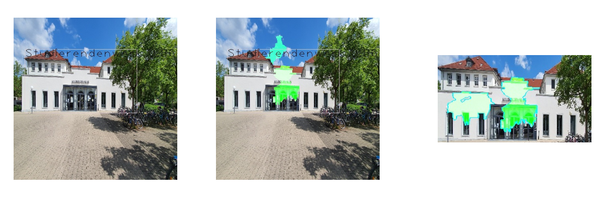

Detection and Explanation of Studierendenwerk (left: only detection, middle: explanation entire image, right: explanation cropped bounding box

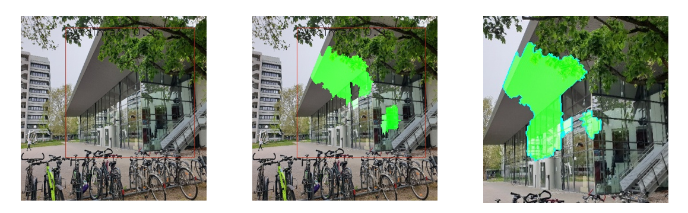

Detection and Explanation of Audimax (left: only detection, middle: explanation entire image, right: explanation cropped bounding box)

The pictures show that the model seems to work rather well and makes its predictions based on the right features since most of the important features are within the bounding box. It also holds even if there are other “non-class” objects like trees in front of it. This can be an indicator for a good localization and that the localization of the bounding box is done based on the correct/reasonable features. The explanations on the cropped images can be seen as an indicator that the classifications are also done on the correct/reasonable features.

**Multiple Objects**

We also tried to get some understanding of what our model does if there are multiple objects in one image. Within the constraints of LIME we used the same approach as described above, but also took a look at the features that decrease the confidence in detecting an object in the image. In this example, the "new library" class has the highest confidence (0.99) and is therefore treated as the label of the image within the LIME framework. It is interesting to see that LIME marks (blue) features of the other object ("old library") in the image as features that decrease the confidence in detecting the "new library". This finding also increases the trust in the model hence features that increase the confidence belongs to the correct object and lie within the respective bounding box, while features decreasing the confidence belong solely to the other object in the image and also lie within the respective bounding box.


Explanation for multiple objects

**Challenges**

At last, we would like to quickly go over some experienced challenges with the chosen procedure. Firstly, we can see below that the explanation of the entire image works well. The important features are within the bounding box and are mostly part of the object. But the important features on the cropped image are not at all reasonable as they do not contain the object.

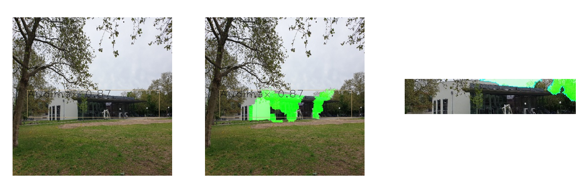

Secondly, the explanation of the cropped image might the flawed if objects of other classes are still in the image. In this example, the important features found on the entire image seem reasonable and lie within the bounding box. Furthermore, the model does not seem to be confused by the building in the far back. But on the cropped image, the important features seem to belong to the an object of the class "old library". The reason is that the confidence in detecting the “old library” on the original image is at a maximum of 0.64, but almost 0.80 on the cropped image while the confidence of the Audimax is only 0.78 for the cropped image. Therefore the "old library" is treated as the label of the image and is explained.

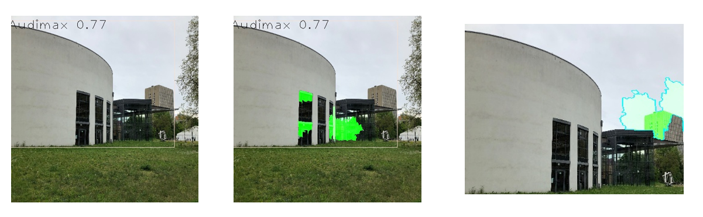

### 6.3.3 Conclusion

Overall, the model seems to use reasonable features for its decision-making, especially for the object its most confident to detect. The example for multiple objects in one image strengthens this impression since reasonable features increase or decrease the confidence. Moreover, there needs to be further discussion on whether cropping the bounding box makes sense and helps further understanding.

# 7. Deployment

_Author: Christopher_

## 7.1 Initial Approach

Our first approach of deploying our model was to install *Darknet* and the necessary dependencies directly on the *Jetson Nano*. After several attempts and numerous googling, we managed to install *Darknet* and run *yolov3* inference on the coco dataset.

In order to ensure that every team member had access to the *Jetson Nano,* we installed a VPN server on a Raspberry Pi giving everybody secure ssh and screen sharing (VNC) access to the *Jetson Nano.* As the VPN connection was not fast enough for a good VNC connection we needed to find a better solution. We then came up with a *Jupyter Lab* server that could be accessed from a browser.

## 7.2 Set-Up of the Inference Environment

With the *Jupyter Lab* server accessible for everybody, we then focused on creating our own inference notebook. The starting point for this notebook was the `darknet_video.py` file from the [AlexeyAB darknet repo](https://github.com/artynet/darknet-alexeyAB). Based on the included functions we developed the class `Inference` that included everything we needed from loading the *Darknet*weights and config file to starting the inference either from a video file or the camera stream. The `Inference` class can be loaded into the inference notebook giving us clean access to its functionality, e.g. `startInference()`, or `stopInference()` without polluting the notebook.

### 7.2.1 Jupyter Widgets

On our first run of the inference over webcam with the *coco* dataset, we soon discovered a problem. The `opencv` library tried to display the inference results in a GUI window, which the *Jupyter Lab* server didn't have. We then stumbled across *Jupyter* *Widgets*. *Jupyter* *Widgets* can be used to build interactive GUIs for notebooks, including buttons and image widgets. We then modified our `Inference` class to display the inferred video stream in an image widget instead of a GUI window and added a "Start" and "Stop" button for controlling the inference threads.

In the first run of our inference notebook with the *Jupyter* *Widgets,* we got a solid 7 FPS on the coco dataset.

### 7.2.2 Dockerization

In order the have a consistent development environment and a consistent entry point in case something goes wrong, we then switched to Docker. Starting with the `[nvcr.io/nvidia/l4t-ml:r32.5.0-py3](http://nvcr.io/nvidia/l4t-ml:r32.5.0-py3)` image from *Nvidia* we created our own `Dockerfile`. The build includes the following steps:

1. Installing *Darknet*
2. Installing the *Nvidia* "jetcam" repository
3. Installing the *Jupyter Lab* server, with the *Jupyter Widgets* extension
4. Adding our own inference notebook and classes from our Github repository

The docker image could then be built and started directly on the *Jetson Nano* giving us a maintainable and consistent development environment. The `Dockerfile` can be seen at the bottom.

## 7.3 Inference

After training our own model, we then added another step to our `Dockerfile`: Getting the weights, `darknet.data` and `yolo.cfg`of the latest run from our Github repository and making them accessible to our `Inference` class.

We thereby wanted to ensure that weights are always saved at the same location allowing us to directly start the inference in the notebook without changing the paths to weights, `darknet.data`, and `yolo.cfg`.

With our own model at hand the inference speed increased to around **17 FPS**.

The final result of our inference notebook can be seen below:


Inference Notebook

## 7.4 Dockerfile

Below you can find the `Dockerfile` used for deploying our model on the _Jetson Nano._

```docker
FROM nvcr.io/nvidia/l4t-ml:r32.5.0-py3

ENV DEBIAN_FRONTEND=noninteractive
ENV CUDA_HOME="/usr/local/cuda"
ENV PATH="/usr/local/cuda/bin:${PATH}"
ENV LD_LIBRARY_PATH="/usr/local/cuda/lib64:${LD_LIBRARY_PATH}"
ENV LLVM_CONFIG="/usr/bin/llvm-config-9"
ENV CUB_PATH="/opt/cub"
ARG MAKEFLAGS=-j6
#
# YOLO
#
RUN apt-get update && apt-get install -y --fix-missing make g++ && apt install -y --fix-missing pkg-config
RUN git clone https://github.com/AlexeyAB/darknet.git
RUN sed -i 's/GPU=0/GPU=1/' ./darknet/Makefile
RUN sed -i 's/CUDNN=0/CUDNN=1/' ./darknet/Makefile
RUN sed -i 's/OPENCV=0/OPENCV=1/' ./darknet/Makefile
RUN sed -i 's/LIBSO=0/LIBSO=1/' ./darknet/Makefile
WORKDIR /darknet
RUN make
#
# Jetcam
#
SHELL ["/bin/bash", "-c"]
WORKDIR /
RUN git clone https://github.com/NVIDIA-AI-IOT/jetcam
WORKDIR /jetcam
RUN python3 setup.py install
#
# NodeJS for Jupyter Widgets
#
WORKDIR /
RUN wget https://nodejs.org/dist/v12.13.0/node-v12.13.0-linux-arm64.tar.xz \
    && tar -xJf node-v12.13.0-linux-arm64.tar.xz
WORKDIR /node-v12.13.0-linux-arm64
RUN cp -R * /usr/local/
RUN node -v
#
# Jupyter
#
RUN jupyter nbextension enable --py widgetsnbextension
RUN jupyter labextension install @jupyter-widgets/jupyterlab-manager
#
# Add Inference related files
#
WORKDIR /darknet
RUN wget https://github.com/pineappledafruitdude/AISSCV/raw/main/deployment/default/Advanced%20Inference%20Model.ipynb && \
    wget https://github.com/pineappledafruitdude/AISSCV/raw/main/deployment/default/Inference.py && \
    wget https://github.com/pineappledafruitdude/AISSCV/raw/main/deployment/default/Video.py
WORKDIR /
RUN mkdir model
WORKDIR /model
RUN wget https://github.com/pineappledafruitdude/AISSCV/raw/main/deployment/default/darknet.data
RUN wget https://github.com/pineappledafruitdude/AISSCV/raw/main/deployment/default/classes.txt
RUN wget https://raw.githubusercontent.com/pineappledafruitdude/AISSCV_results/master/final/run_1/yolo.cfg
RUN wget https://github.com/pineappledafruitdude/AISSCV_results/raw/master/final/run_1/weights/yolo_final.weights

WORKDIR /
RUN mkdir data
CMD jupyter lab --ip 0.0.0.0 --port 8888 --allow-root &> /var/log/jupyter.log
```

# 8. Outlook

_Author: Danil_

## 8.1 Summary

We succeeded in creating a model with small size, strong performance, and real-time detection based on yolov4-tiny. Additionally, we managed to code an end-to-end pipeline from image input to training output and a deployment pipeline. Finally, we validated our business case with both customer interviews and market research.

## 8.2 Next steps

Yet, we see further steps that can be taken to further develop our project. First, the model can be further improved with more data, more KIT buildings, and a Grid or Random Search for the optimization of hyper-parameters. Second, we can follow an ensemble learning approach and build further models to function under different circumstances, e.g. in winter or at night. Models can be exchanged based on API queries, drift detection methods, or with a tree search. Third, we can include further model inputs, such as GPS data, in order to increase model performance. Fourth, we can start user tests with our prototype and get detailed customer feedback. Fifth, detailed descriptions of the detections can be added and the minimum viable product can be launched. Following a value co-creation approach, we then use user detections to further increase training data and ensure data quality.
