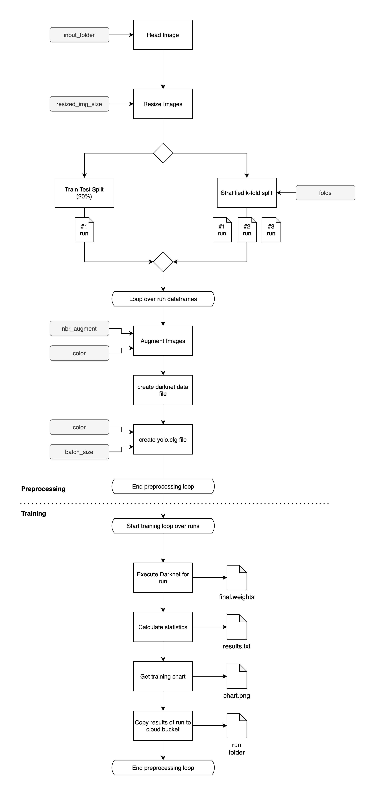

# Pipeline Overview



# Install

Python Version used: 3.9.5

<div style="color:red; margin-bottom: 20px; text-align:center; font-weight: bold; padding: 5px; background: #e5e5e5">
You MUST be in the preprocessing folder in your terminal
</div>

1. Create venv

```zsh
python3 -m venv ./env
```

1. Activate venv

```zsh
source env/bin/activate
```

2. Install requirements

```zsh
pip3 install -r requirements.txt
```

# Execute Pipeline

<div style="color:red; margin-bottom: 20px; text-align:center; font-weight: bold; padding: 5px; background: #e5e5e5">
Copy the original images in the preprocessing data directory<br>
The images in the input path provided are overwritten with the resized ones
</div>

Run the following minimal command to execute the pipeline:

```zsh
python3 run_pipe.py -n "The name of the run"
```

## Arguments

The following arguments can be passed when calling `python3 run_pipe.py -n "Name"`:

| arg          | Type   | Default                                        |                         | Description                                                                                                    |
| ------------ | ------ | ---------------------------------------------- | ----------------------- | -------------------------------------------------------------------------------------------------------------- |
| -n           | `str`  | -                                              | Name                    | Name of this pipeline run. A subfolder with this name will be created in the output directory                  |
| -i           | `str`  | `./data`                                       | Input Folder            | Path where the original images are stored. Default to "./data"                                                 |
| -cls         | `str`  | `./data/classes.txt`                           | Darknet classes file    | Full path to the darknet classes file. E.g. "./data/classes.txt"                                               |
| -o           | `str`  | `./output`                                     | Output Folder           | Path where the results of this pipeline run are stored. Default to "./output"                                  |
| -c           | `bool` | `0`                                            | Color                   | Whether the images are colored or greyscaled                                                                   |
| -f           | `int`  | `1`                                            | Number of folds         | If f=1 then a train_test_split is performed (20%) if f>1 f-folds are created for training                      |
| -yolo_cfg    | `str`  | `../model/darknet_cfgs/yolov4-tiny-custom.cfg` | Yolo cfg file           | Original yolovX config file that is beeing modified. Default to '../model/darknet_cfgs/yolov4-tiny-custom.cfg' |
| -batch_size  | `int`  | `3000`                                         | Batch size              | Max batch size that is saved to the yolovX.cfg file used for training                                          |
| -nbr_augment | `int`  | `10`                                           | Number of augmentations | Number of augmentations to perform per train image                                                             |

## Other options

The following other options can be configured in the file `run_pipe.py`:

| Config           | Description                                                                                                                                                     |
| ---------------- | --------------------------------------------------------------------------------------------------------------------------------------------------------------- |
| resized_img_size | The size of the images before the augmentation is applied. Actually the original images in the input folder are cropped in place before the augmentation starts |
| final_img_size   | The image size after the pipeline is done. Applies to all train & test images.                                                                                  |
