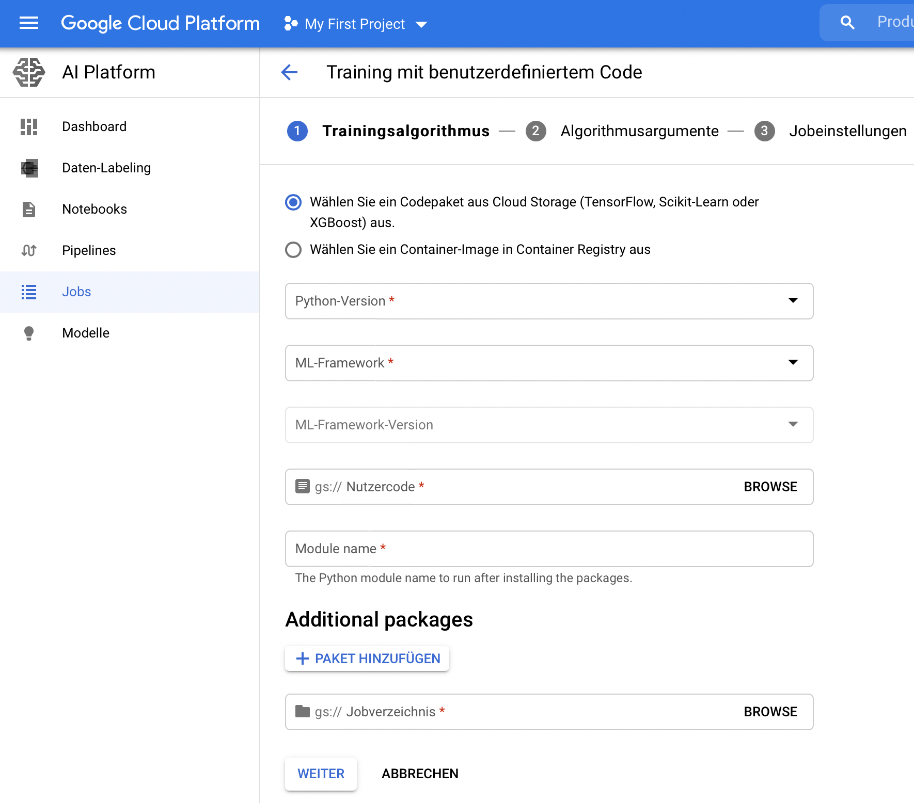
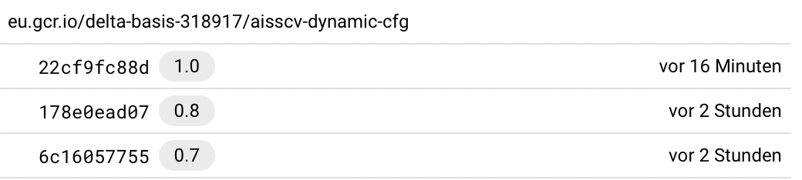
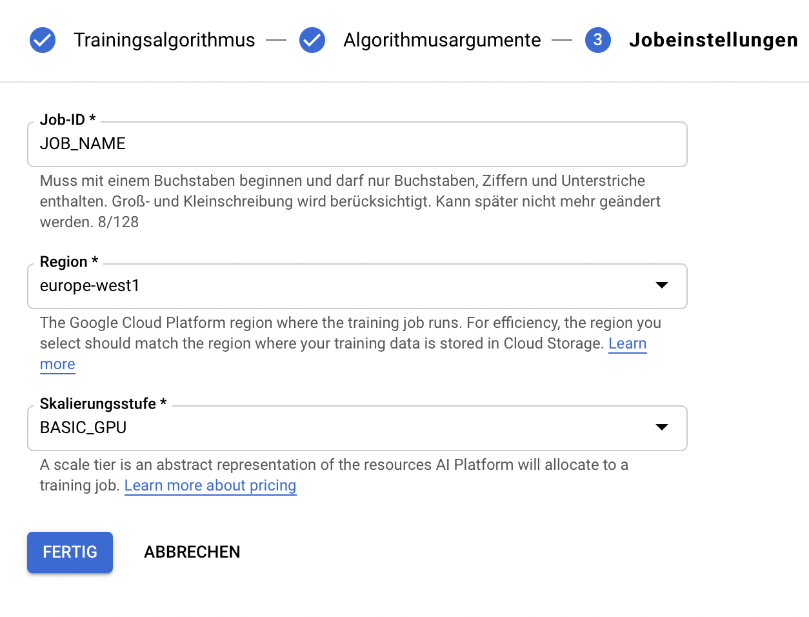

# Training

Training is done via google cloud AI Platform
<br>
Image: `eu.gcr.io/delta-basis-318917/aisscv-dynamic-cfg:1.0`

## Arguments for Training

| arg             |  Type  | Default | Description                                                                               |
| --------------- | :----: | :-----: | ----------------------------------------------------------------------------------------- |
| --color         | `bool` |         | Whether the images are colored or greyscaled. Add the --color if you want colored images  |
| --folds         | `int`  |   `1`   | If f=1 then a train_test_split is performed (20%) if f>1 f-folds are created for training |
| --batch_size    | `int`  | `3000`  | Max batch size that is saved to the yolovX.cfg file used for training                     |
| --augmentations | `int`  |  `10`   | Number of augmentations to perform per train image                                        |
| --transform     | `int`  |   `1`   | Transformations function to be applied. Either `1`or `2`                                  |
| --occlude       | `bool` |         | Add the occlude flag if you want images to be occluded                                    |
| --incl_no_label | `bool` |         | Add the incl_no_label flag if you want no label images to be added to training data       |

## Submitting a Job

1. Open google cloud console
2. Click on AI Platform -> Jobs
3. Add new job with custom code
4. Click on the select master image button<br>
   
5. Select the Image `eu.gcr.io/delta-basis-318917/aisscv-dynamic-cfg:1.0`<br>
   
6. Click on next
7. Add the parameters show above. Each in one line: e.g

    ```
    --name=run_1
    --color
    --folds=5
    --occlude
    ```

    

8. Click on next
9. Enter a job name
10. Select `europe-west1` as region
11. Select `BASIC_GPU` as scale tier
12. Click on `Done`

# Results

Results will be saved to a google cloud bucket
